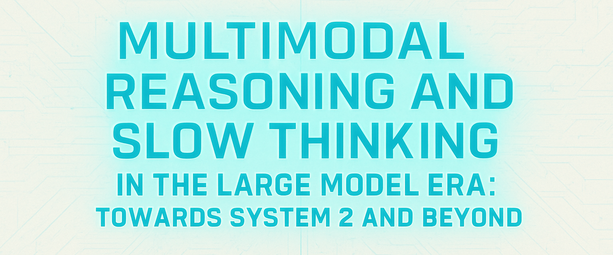

  <h1>🌌 MARS2 @ ICCV 2025</h1>
  
<i>Multimodal Reasoning and Slow Thinking in the Large Model Era: Towards System 2 and Beyond</i>

  

    📅 October 2025 | 📍 Honolulu, Hawaii | 📖 ICCV 2025 Workshop  
  

---

## 🔍 About MARS2

The era of **Large Reasoning Models (LRMs)** has begun, bringing new opportunities and challenges to the computer vision and multimodal AI community. While **Large Language Models (LLMs)** excel at semantic understanding, the next frontier is **System-2 style slow thinking**—reasoning beyond pattern recognition to **multi-step, causal, and neuro-symbolic reasoning**.

**MARS2 (Multimodal Reasoning and Slow Thinking)** is an official workshop of **ICCV 2025**. Our goal is to unite researchers from computer vision, multimodal learning, and reasoning to explore how AI systems can achieve flexible, robust, and interpretable reasoning.

### 🌟 Key Features

- **Workshop at ICCV 2025**  
  Hosted in Honolulu, Hawaii, featuring keynote talks from world-renowned researchers in AI and computer vision.

- **High-Stakes Reasoning Competition**  
  A large-scale challenge with a **¥100,000 (~$14,000)** prize pool, testing MLLMs on a diverse set of reasoning-oriented benchmarks.

- **Open-Source Baselines & Experiments**  
  Provides official repositories with baseline implementations using state-of-the-art models like **Qwen-VL, InternVL, and Ferret** to facilitate research and participation.

- **Fostering Community Collaboration**  
  Bringing together experts to define the next frontier of AI by bridging computer vision, NLP, and System-2 reasoning.

---

## 🏆 The MARS2 Challenge

The workshop hosts the **MARS2 Multimodal Reasoning Challenge**, designed to push the boundaries of current MLLMs on complex reasoning tasks. The challenge is divided into distinct tracks, each with corresponding baseline models and official code repositories.

| Track | Task Description | Core Models | Repository |
| :--- | :--- | :--- | :--- |
| **Track 1** | **Fine-Grained Referring & Grounding**: Given an image and a textual query, the model must output the corresponding bounding box coordinates for the referred object. | `Ferret`, `Qwen2.5-VL`, `Groma` | [**MARS2_Track1_Ferret**](https://github.com/your-username/MARS2_Track1_Ferret)  [**MARS2_Track1_Qwen2.5-VL**](https://github.com/mars2workshop/MARS2_Track1_Qwen2.5-VL) [**MARS2_Track1_Groma**](https://github.com/mars2workshop/MARS2_Track1_Groma)|
| **Track 2** | **VQA with Spatial Awareness**: Evaluates a model's ability to reason about spatial relationships, relative positions, commonsense, and counterfactual scenarios. | `Qwen2.5-VL`, `InternVL3`, `Mllms_know` | [**MARS2_Track2_QwenVL**](https://github.com/your-username/MARS2_Track2_Qwen2.5-VL) [**MARS2_Track2_internVL3**](https://github.com/mars2workshop/MARS2_Track2_InternVL3)  [**MARS2_Track2_Mllms_know**](https://github.com/mars2workshop/MARS2_Track2_Mllms_know)|

The challenge will test performance on benchmarks including **[LENS](https://arxiv.org/abs/2505.15616), AdsVQA**, open-ended reasoning tasks, designed for System-2 evaluation.

---

## 💻 Official Repositories

This organization serves as the official hub for all workshop activities, competition tracks, and related experiments.

| Repository | Description |
| :--- | :--- |
| 🌐 [**Homepage**](https://mars2workshop.github.io/iccv2025/) | The official website for the MARS2 @ ICCV 2025 Workshop, including the schedule, CFP, organizers, and keynote speakers. |
| [**MARS2_Track1_Ferret**](https://github.com/your-username/MARS2_Track1_Ferret) | Baseline implementation for **Track 1**, using the Ferret model for referring and grounding tasks. |
| [**MARS2_Track1_Qwen2.5-VL**](https://github.com/mars2workshop/MARS2_Track1_Qwen2.5-VL) | An alternative baseline for **Track 1**, using the Qwen2.5-VL model for referring and grounding tasks. |
| [**MARS2_Track1_Groma**](https://github.com/mars2workshop/MARS2_Track1_Groma)| A batch inference pipeline using Groma, a grounded multimodal large language model (MLLM) with strong region understanding and visual grounding capabilities, for referring and grounding tasks. |
| [**MARS2_Track2_Qwen2.5-VL**](https://github.com/your-username/MARS2_Track2_Qwen2.5-VL) | Baseline implementation for **Track 2**, using the Qwen-VL model for Visual Question Answering with Spatial Awareness. |
| [**MARS2_Track2_internVL3**](https://github.com/your-username/MARS2_Track2_internVL3) | An alternative baseline for **Track 2**, using the InternVL model for spatial reasoning tasks. |
| [**MARS2_Track2_Mllms_know**](https://github.com/mars2workshop/MARS2_Track2_Mllms_know) | An experimental implementation based on the ICLR 2025 paper for training-free perception of small visual details using Qwen2.5-VL. |

⚠️ These model-specific folders provide experimental support for benchmarking and challenge tasks. They are intended as baselines and resources for participants.

## 🙏 Acknowledgement

We gratefully acknowledge the contributions of the following open-source projects, which form the foundation for our experimental extensions and benchmarking.

- **[Qwen](https://qwenlm.github.io/)**: A powerful series of large language and vision-language models by Alibaba Cloud.
- **[InternVL](https://internvl.github.io/)**: A foundational open-source vision-language model designed for advanced multimodal understanding.
- **[Ferret](https://github.com/apple/ml-ferret)**: An MLLM capable of referring and grounding anything anywhere at any granularity.
- **[Groma](fhttps://github.com/FoundationVision/Groma/)**: An MLLM with exceptional region understanding and visual grounding capabilities.

---

## 👍 Citation

If you use MARS2 materials, benchmarks, or code in your research, please cite our workshop:

